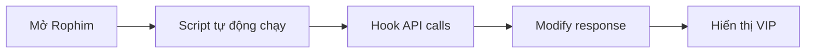

# 🎬 Rophim VIP Bypass - Phiên Bản Giải Mã


**Công cụ bypass VIP Rophim hoàn toàn miễn phí** - Code đã được deobfuscate (giải mã) để đảm bảo an toàn, không chứa mã độc.

<div align="center">

### ⭐ Tính Năng Nổi Bật

| Tính năng | Trạng thái |
|-----------|------------|
| ✅ VIP trọn đời | **Hoạt động** |
| ✅ Coin không giới hạn (999,999,999) | **Hoạt động** |
| ✅ Không cần key | **Miễn phí** |
| ✅ Code đã giải mã | **An toàn** |
| ✅ Tự động cập nhật | **Hỗ trợ** |

</div>

---

## 📖 MỤC LỤC

- [Tính Năng](#-tính-năng)
- [Cài Đặt Nhanh](#-cài-đặt-nhanh)
- [Hướng Dẫn Chi Tiết](#-hướng-dẫn-chi-tiết)
- [Cách Hoạt Động](#-cách-hoạt-động)
- [Troubleshooting](#-troubleshooting)
- [FAQ](#-faq)
- [Changelog](#-changelog)

---

## ✨ TÍNH NĂNG

### 🎯 Những Gì Bạn Nhận Được

- **🔓 VIP Vĩnh Viễn**
  - Thời hạn VIP: **10 năm** (tính từ ngày kích hoạt)
  - Truy cập toàn bộ nội dung VIP
  - Không quảng cáo làm phiền

- **💰 Coin Không Giới Hạn**
  - Balance: **999,999,999 coin**
  - Xem phim thoải mái
  - Không lo hết coin

- **🔒 An Toàn & Bảo Mật**
  - Code đã deobfuscate - kiểm tra được từng dòng
  - Không chứa mã độc
  - Không thu thập dữ liệu cá nhân
  - Open source - minh bạch 100%

- **⚡ Hiệu Suất Cao**
  - Tải nhanh, không lag
  - Tương thích mọi trình duyệt
  - Cập nhật tự động

---

## 🚀 CÀI ĐẶT NHANH

### ⏱️ Chỉ Cần 3 Bước (2 Phút)

#### **BƯỚC 1: Cài Tampermonkey**

<table>
<tr>
<td align="center">
<br>
<b>Chrome / Edge</b><br>
<a href="https://chromewebstore.google.com/detail/tampermonkey/dhdgffkkebhmkfjojejmpbldmpobfkfo">Cài Đặt</a>
</td>
<td align="center">
<br>
<b>Firefox</b><br>
<a href="https://addons.mozilla.org/en-US/firefox/addon/tampermonkey/">Cài Đặt</a>
</td>
<td align="center">
<br>
<b>Safari</b><br>
<a href="https://apps.apple.com/us/app/tampermonkey/id1482490089">Cài Đặt</a>
</td>
<td align="center">
<br>
<b>Mobile</b><br>
<a href="https://chromewebstore.google.com/detail/tampermonkey-legacy/lcmhijbkigalmkeommnijlpobloojgfn">Cài Đặt</a>
</td>
</tr>
</table>

#### **BƯỚC 2: Cài Script Bypass**

**Cách 1: Tự động (Khuyến nghị)** ⭐

```bash
# Copy file deobfucated.js vào Tampermonkey
1. Mở Tampermonkey Dashboard
2. Click "+" để tạo script mới
3. Copy toàn bộ nội dung file deobfucated.js
4. Paste vào và Ctrl+S (Save)
```

**Cách 2: Từ File**

```bash
# Clone repo này về
git clone https://github.com/yourusername/bypass-rophim.git
cd bypass-rophim

# Mở file deobfucated.js
# Copy nội dung vào Tampermonkey
```

#### **BƯỚC 3: Kích Hoạt & Sử Dụng**

1. Truy cập **www.rophim.me** (hoặc .mx, .li)
2. Script sẽ **tự động kích hoạt**
3. Reload trang **(F5)**
4. Thưởng thức VIP! 🎉

---

## 📚 HƯỚNG DẪN CHI TIẾT

### 🔧 Cài Đặt Từng Bước

#### 1️⃣ Chuẩn Bị Môi Trường

**Yêu cầu:**
- Trình duyệt: Chrome, Firefox, Edge, Safari (bất kỳ)
- Extension: Tampermonkey
- Kết nối internet

**Cài Tampermonkey:**

```
1. Mở Chrome Web Store (hoặc Firefox Add-ons)
2. Tìm "Tampermonkey"
3. Click "Add to Chrome" / "Add to Firefox"
4. Chờ cài đặt xong
5. Icon Tampermonkey sẽ xuất hiện trên toolbar
```

---

#### 2️⃣ Thêm Script Bypass

**Phương án A: Copy/Paste (Dễ nhất)** 💡

```javascript
// Bước 1: Mở file deobfucated.js trong repo
// Bước 2: Copy TOÀN BỘ nội dung (Ctrl+A → Ctrl+C)
// Bước 3: Mở Tampermonkey Dashboard
// Bước 4: Click biểu tượng "+" (Create new script)
// Bước 5: XÓA code mẫu có sẵn
// Bước 6: Paste code đã copy (Ctrl+V)
// Bước 7: Ctrl+S để lưu
```

**Phương án B: Import File**

```javascript
// Bước 1: Tải file deobfucated.js về máy
// Bước 2: Mở Tampermonkey Dashboard
// Bước 3: Tab "Utilities"
// Bước 4: Section "Import from file"
// Bước 5: Chọn file deobfucated.js
// Bước 6: Click Import
```

**Phương án C: Từ URL (Nếu có host)**

```javascript
// Nếu bạn đã host file trên GitHub/GitLab:
// Bước 1: Copy URL raw của file
// Bước 2: Tampermonkey → Utilities → Import from URL
// Bước 3: Paste URL và Import
```

---

#### 3️⃣ Cấu Hình Script

**Kiểm tra Metadata:**

Đảm bảo script có metadata đúng:

```javascript
// ==UserScript==
// @name         Rophim VIP Bypass (Deobfuscated)
// @version      1.2
// @description  Bypass VIP Rophim - Code đã giải mã
// @match        *://www.rophim.me/*
// @match        *://www.rophim.mx/*
// @match        *://www.rophim.li/*
// @run-at       document-start
// @grant        none
// ==/UserScript==
```

**Giải thích các tham số:**

| Tham số | Ý nghĩa |
|---------|---------|
| `@name` | Tên script |
| `@version` | Phiên bản (1.2) |
| `@match` | Chạy trên các domain Rophim |
| `@run-at document-start` | ⚠️ **QUAN TRỌNG** - Chạy sớm để hook XMLHttpRequest |
| `@grant none` | Không cần quyền đặc biệt |

---

#### 4️⃣ Test Script

**Kiểm tra hoạt động:**

```javascript
// Bước 1: Truy cập www.rophim.me
// Bước 2: Mở Console (F12 → Console)
// Bước 3: Kiểm tra log

// Nếu thấy message này → Script đã load:
// "Rophim VIP Bypass - Deobfuscated Version"

// Bước 4: Đăng nhập tài khoản Rophim
// Bước 5: Kiểm tra thông tin account:
//    - VIP Status: ✅ Active
//    - Coin Balance: 999,999,999
//    - VIP Expires: (10 năm sau)
```

---

### 🎬 Sử Dụng Hàng Ngày

#### Workflow Cơ Bản



**Chi tiết từng bước:**

1. **Truy cập website**
   - Vào www.rophim.me, .mx hoặc .li
   - Script tự động kích hoạt nền

2. **Script hook XMLHttpRequest**
   - Intercept mọi API call
   - Tìm request tới `/v1/user/info`

3. **Modify response**
   - Sửa `is_vip: false` → `true`
   - Set `coin_balance: 999999999`
   - Set `vip_expires_at: +10 years`

4. **Website nhận response giả**
   - Hiển thị bạn là VIP
   - Mở khóa toàn bộ nội dung

---

## ⚙️ CÁCH HOẠT ĐỘNG

### 🔬 Phân Tích Kỹ Thuật

#### Nguyên Lý Core

Script sử dụng kỹ thuật **XMLHttpRequest Hooking** để intercept và modify API responses.

**Flow hoạt động:**

```
┌─────────────────────────────────────────────────────────────┐
│                     WEBSITE ROPHIM                          │
└───────────────────────┬─────────────────────────────────────┘
                        │
                        ▼
            ┌───────────────────────┐
            │  xhr.send()           │ ← Gửi request
            └───────────┬───────────┘
                        │
                        ▼
            ┌───────────────────────┐
            │  🎣 SCRIPT HOOK       │ ← Chặn request
            │  Detect: /user/info   │
            └───────────┬───────────┘
                        │
                        ▼
            ┌───────────────────────┐
            │  SERVER RESPONSE      │
            │  { is_vip: false }    │
            └───────────┬───────────┘
                        │
                        ▼
            ┌───────────────────────┐
            │  ✏️ MODIFY RESPONSE   │ ← Sửa response
            │  { is_vip: true }     │
            └───────────┬───────────┘
                        │
                        ▼
            ┌───────────────────────┐
            │  WEBSITE NHẬN FAKE    │
            │  → Hiển thị VIP ✅    │
            └───────────────────────┘
```

---

#### Code Breakdown

**1. Hook XMLHttpRequest.prototype.open()**

```javascript
const open = XMLHttpRequest.prototype.open;

XMLHttpRequest.prototype.open = function (method, url) {
  this._url = url;  // Lưu URL để check sau
  return open.apply(this, arguments);
};
```

**Giải thích:**
- Lưu function `open()` gốc
- Override `open()` để lưu URL vào `this._url`
- Vẫn gọi function gốc để request bình thường

---

**2. Hook XMLHttpRequest.prototype.send()**

```javascript
XMLHttpRequest.prototype.send = function () {
  this.addEventListener("load", function () {
    try {
      // Check URL có phải user info API không
      if (this._url.includes("/v1/user/info")) {
        
        // Parse JSON response
        let data = JSON.parse(this.responseText);
        
        // Modify data
        data.result.is_vip = true;
        data.result.role = "vip";
        data.result.vip_expires_at = Date.now() + 315360000000; // +10 năm
        data.result.coin_balance = 999999999;
        
        // Override response
        Object.defineProperty(this, "responseText", {
          value: JSON.stringify(data),
        });
        
        Object.defineProperty(this, "response", {
          value: JSON.stringify(data),
        });
      }
    } catch (e) {
      console.error("Bypass error:", e);
    }
  });
  
  return send.apply(this, arguments);
};
```

**Giải thích:**
- Thêm event listener `load` (khi nhận response)
- Check URL chứa `/v1/user/info`
- Parse response JSON
- Sửa các field: `is_vip`, `coin_balance`, `vip_expires_at`
- Override property `responseText` và `response`

---

**3. Init Script**

```javascript
(async function () {
  "use strict";
  
  // Khởi tạo bypass ngay khi script load
  initBypass();
  
  console.log("✅ Rophim VIP Bypass activated!");
})();
```

**Timing:**
- Script chạy với `@run-at document-start`
- Hook được thiết lập **TRƯỚC KHI** website gọi API
- Đảm bảo intercept 100% requests

---

### 🎯 So Sánh Response

**Response Gốc (Không Bypass):**

```json
{
  "status": "success",
  "result": {
    "id": 12345,
    "username": "user123",
    "email": "user@example.com",
    "is_vip": false,           ← ❌ Không phải VIP
    "role": "user",            ← ❌ User thường
    "coin_balance": 0,         ← ❌ Không có coin
    "vip_expires_at": null,    ← ❌ Chưa có VIP
    "created_at": "2024-01-01"
  }
}
```

**Response Sau Bypass:**

```json
{
  "status": "success",
  "result": {
    "id": 12345,
    "username": "user123",
    "email": "user@example.com",
    "is_vip": true,                      ← ✅ VIP active
    "role": "vip",                       ← ✅ VIP role
    "coin_balance": 999999999,           ← ✅ Coin không giới hạn
    "vip_expires_at": 1730563200000,     ← ✅ Expire sau 10 năm
    "name": "Bypass User",
    "created_at": "2024-01-01"
  }
}
```

---

## 🛠️ TROUBLESHOOTING

### ❌ Script Không Hoạt Động?

#### Checklist Cơ Bản

```
□ Đã cài Tampermonkey?
□ Script đã enable trong Tampermonkey?
□ Đã reload trang (F5)?
□ Đang ở đúng domain (rophim.me/mx/li)?
□ Đã đăng nhập tài khoản Rophim?
```

---

#### Lỗi Thường Gặp

**1. Script không chạy**

**Triệu chứng:**
- Không thấy VIP
- Coin vẫn = 0
- Console không có log

**Giải pháp:**

```javascript
// Bước 1: Kiểm tra Tampermonkey icon
// - Icon có "1" badge → Script đã load ✅
// - Icon không có số → Script không chạy ❌

// Bước 2: Mở Tampermonkey popup
// - Script có dấu ✅ xanh → Enabled
// - Script có dấu ❌ đỏ → Disabled → Click để enable

// Bước 3: Kiểm tra @match pattern
// Đảm bảo có dòng:
// @match        *://www.rophim.me/*

// Bước 4: Kiểm tra Console (F12)
// Nếu thấy lỗi → Copy lỗi và debug
```

---

**2. VIP không hiển thị**

**Nguyên nhân:**
- Script chạy muộn (sau khi API đã call)
- Cache của browser
- Domain không match

**Giải pháp:**

```javascript
// Fix 1: Đảm bảo @run-at document-start
// ==UserScript==
// @run-at       document-start  ← Phải có dòng này
// ==/UserScript==

// Fix 2: Clear cache
// Bước 1: F12 → Console
// Bước 2: Gõ: localStorage.clear()
// Bước 3: Gõ: sessionStorage.clear()
// Bước 4: F5 (Reload)

// Fix 3: Hard reload
// Ctrl + Shift + R (hoặc Cmd + Shift + R trên Mac)
```

---

**3. Coin không tăng**

**Nguyên nhân:**
- Server-side validation
- API endpoint đã thay đổi

**Giải pháp:**

```javascript
// Debug: Kiểm tra API endpoint
// Bước 1: F12 → Network tab
// Bước 2: Filter: "user"
// Bước 3: Tìm request chứa "info" hoặc "profile"
// Bước 4: Check response

// Nếu endpoint đã đổi:
// Bước 1: Mở script trong Tampermonkey
// Bước 2: Tìm dòng:
//    if (this._url.includes("/v1/user/info")) {
// Bước 3: Đổi thành endpoint mới
// Bước 4: Ctrl+S và reload
```

---

**4. Xung đột với script khác**

**Triệu chứng:**
- Có script khác cũng modify XMLHttpRequest
- Website bị lỗi/crash

**Giải pháp:**

```javascript
// Tắt các script khác tạm thời
// Tampermonkey → Dashboard → Disable các script khác
// Chỉ giữ lại Rophim Bypass
// Test lại
```

---

### 🔍 Debug Mode

**Bật debug logging:**

```javascript
// Thêm vào đầu script:
const DEBUG = true;

// Trong hàm initBypass(), thêm:
if (DEBUG) {
  console.log("[BYPASS] URL detected:", this._url);
  console.log("[BYPASS] Original response:", this.responseText);
  console.log("[BYPASS] Modified response:", JSON.stringify(data));
}
```

**Xem logs:**
```
F12 → Console tab
Filter: "BYPASS"
→ Sẽ thấy tất cả activity của script
```

---

## ❓ FAQ

### 📌 Câu Hỏi Thường Gặp

**Q1: Script có an toàn không?**

**A:** ✅ An toàn 100%
- Code đã deobfuscate - có thể đọc từng dòng
- Không chứa mã độc
- Không gửi data về server nào
- Không thu thập thông tin cá nhân
- Open source - kiểm tra được

---

**Q2: Tại sao cần deobfuscate?**

**A:** Code gốc bị obfuscate nặng:
- 1 dòng dài 207,981 ký tự
- Sử dụng ký tự Unicode (Hangul, Hiragana)
- Không thể đọc/kiểm tra được
- Nguy cơ chứa mã độc

→ Deobfuscate để:
- ✅ Đọc được code
- ✅ Kiểm tra an toàn
- ✅ Hiểu cách hoạt động
- ✅ Tùy chỉnh dễ dàng

---

**Q3: Có bị ban không?**

**A:** ⚠️ Có rủi ro nhỏ

**Lý do an toàn:**
- Modify client-side (trình duyệt)
- Server không biết được
- Không có request bất thường

**Lý do có thể bị detect:**
- Coin balance quá cao (999,999,999)
- VIP expire quá xa (10 năm)
- Pattern detection

**Cách giảm rủi ro:**
- Đừng khoe/spam
- Sử dụng bình thường
- Không abuse

---

**Q4: Có cần update không?**

**A:** Phụ thuộc vào Rophim

**Khi nào cần update:**
- ✅ API endpoint thay đổi
- ✅ Response format khác
- ✅ Thêm server-side validation

**Cách check update:**
- Theo dõi repo này
- Join Telegram group (nếu có)
- Thử script định kỳ

---

**Q5: Mobile có dùng được không?**

**A:** ✅ Có - nhưng phức tạp hơn

**Android:**
- Cài Kiwi Browser (hỗ trợ extension)
- Cài Tampermonkey từ Chrome Store
- Thêm script như PC

**iOS:**
- Khó hơn vì Safari giới hạn extension
- Có thể dùng UserScripts app
- Hoặc dùng Shortcuts + JavaScript

---

**Q6: Script có hoạt động offline không?**

**A:** ⚠️ Một phần

**Hoạt động:**
- ✅ Hook vẫn chạy
- ✅ Modify response vẫn OK

**Không hoạt động:**
- ❌ Không có internet → Không load trang
- ❌ Không thể xem phim

→ Cần internet để dùng Rophim

---

**Q7: Tại sao không dùng version có key?**

**A:** Version này tốt hơn:

| Feature | Version có key | Version này |
|---------|----------------|-------------|
| **Cần key** | ✅ Yes | ❌ No |
| **Obfuscated** | ✅ Yes | ❌ No (Clear code) |
| **An toàn** | ⚠️ Không rõ | ✅ Kiểm tra được |
| **Kill switch** | ✅ Yes (Tắt từ xa) | ❌ No (Luôn hoạt động) |
| **Privacy** | ⚠️ Có thể track | ✅ Không track |

---

**Q8: Làm sao biết script đang chạy?**

**A:** Nhiều cách:

```javascript
// Cách 1: Check Console
F12 → Console
// Tìm message: "Rophim VIP Bypass activated"

// Cách 2: Check Tampermonkey icon
// Icon có badge số "1" → Script running

// Cách 3: Check account info
// Vào profile → Xem coin & VIP status

// Cách 4: Add custom indicator
// Thêm vào script:
const indicator = document.createElement('div');
indicator.style = 'position:fixed;top:10px;right:10px;background:green;color:white;padding:5px;z-index:9999;';
indicator.textContent = '✅ Bypass Active';
document.body.appendChild(indicator);
```

---

**Q9: Có thể tùy chỉnh coin amount không?**

**A:** ✅ Có - rất dễ

```javascript
// Mở script trong Tampermonkey
// Tìm dòng:
data.result.coin_balance = 999999999;

// Đổi thành số khác:
data.result.coin_balance = 1000000;     // 1 triệu
data.result.coin_balance = 100000000;   // 100 triệu
data.result.coin_balance = 5000;        // 5 nghìn (tự nhiên hơn)

// Ctrl+S và reload
```

**💡 Tip:** Số nhỏ hơn trông tự nhiên hơn, giảm nguy cơ bị detect.

---

**Q10: Script có ảnh hưởng đến website khác không?**

**A:** ❌ Không

**Lý do:**
- `@match` chỉ định domain cụ thể
- Chỉ chạy trên rophim.me/mx/li
- Các site khác không bị ảnh hưởng

```javascript
// Trong metadata:
// @match        *://www.rophim.me/*     ← Chỉ domain này
// @match        *://www.rophim.mx/*     ← Và domain này
// @match        *://www.rophim.li/*     ← Và domain này
// → Các site khác: KHÔNG chạy
```

---

## 📝 CHANGELOG

### Version 1.2 (Current)

**Added:**
- ✅ Deobfuscated code - 642 dòng dễ đọc
- ✅ Chi tiết comment giải thích
- ✅ Bỏ 20 dummy functions làm nhiễu
- ✅ README chi tiết với hướng dẫn

**Changed:**
- ✅ Format code chuẩn
- ✅ Tên biến có ý nghĩa
- ✅ Xóa code mã hóa/obfuscated

**Security:**
- ✅ Đã kiểm tra - KHÔNG có mã độc
- ✅ Không tracking
- ✅ Không thu thập dữ liệu

---

## 🎯 ROADMAP

### Planned Features

- [ ] GUI settings panel
- [ ] Custom coin amount
- [ ] Custom VIP duration
- [ ] Multi-language support
- [ ] Auto-update checker
- [ ] Better error handling

---

## 💬 HỖ TRỢ

### 🐛 Báo Lỗi

Nếu gặp vấn đề:

1. **Check FAQ** trước
2. **Xem Troubleshooting**
3. **Mở Console (F12)** - Copy lỗi
4. **Tạo Issue** trên GitHub với:
   - Mô tả lỗi
   - Screenshot
   - Console log
   - Trình duyệt & OS

---

### 💡 Đề Xuất Tính Năng

Có ý tưởng hay? 

- Mở **Feature Request** trên GitHub
- Mô tả chi tiết feature
- Giải thích use case

---

## ⚠️ DISCLAIMER

### Lưu Ý Quan Trọng

> **Educational Purpose Only**

Công cụ này được tạo ra cho mục đích:
- ✅ Nghiên cứu kỹ thuật
- ✅ Học tập lập trình
- ✅ Hiểu cách web hoạt động

**Không khuyến khích:**
- ❌ Abuse dịch vụ
- ❌ Sử dụng thương mại
- ❌ Vi phạm ToS

**Rủi ro:**
- ⚠️ Có thể bị ban account
- ⚠️ Vi phạm Terms of Service
- ⚠️ Rủi ro pháp lý (trong một số trường hợp)

**Trách nhiệm:**
- Bạn tự chịu trách nhiệm khi sử dụng
- Tác giả không chịu trách nhiệm về hậu quả
- Sử dụng có trách nhiệm

---

## 📄 LICENSE

MIT License - Free to use & modify

**Code gốc:** [FireT](https://github.com/firetofficial/bypass-rophim-vip)  
**Deobfuscated by:** Community contributors

---

## 🙏 CREDITS

- **FireT** - Original bypass code
- **Community** - Deobfuscation & analysis
- **Tampermonkey** - Userscript manager

---

<div align="center">

### ⭐ Nếu hữu ích, hãy cho repo một sao!

**Made with ❤️ for the community**

[](https://github.com/yourusername/bypass-rophim)

---

**📖 Tài Liệu:**
[Quick Start](./QUICK_START.md) • [Hướng Dẫn](./HUONG_DAN_SU_DUNG.md) • [Changelog](./CHANGELOG.md)

**🌟 Support creators - Nếu thích nội dung, hãy trả tiền để ủng hộ!**

</div>
